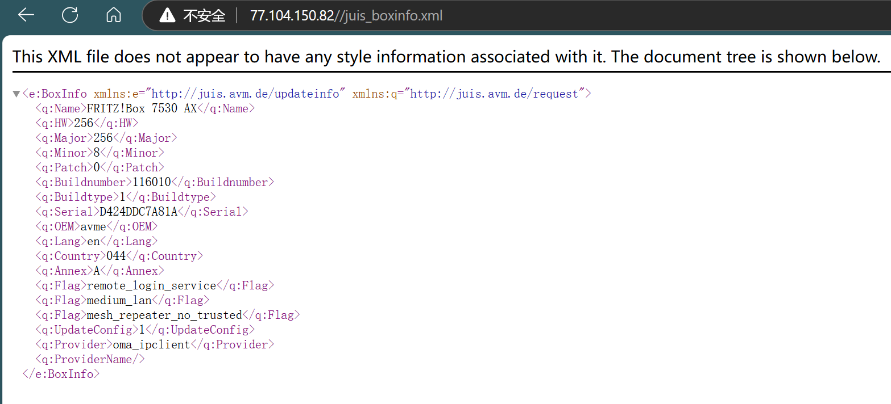

# AVM FRITZ!Box 7530 AX Unauthorized Access Vulnerability 1

## 0x01 Vulnerability description

A vulnerability is in the '/juis_boxinfo.xml' page of the AVM FRITZ!Box 7530 AX, version is 7.59.This flaw allows remote attackers to obtain sensitive information, including boxinfo,  life model name, without undergoing any authentication process.

```
http://77.104.150.82//juis_boxinfo.xml
```

## 0x02 Affected version

``` 
 AVM FRITZ!Box 7530 AX
```

## 0x03 PoC verification

Visiting the corresponding page directly through the browser can reveal the version information about the device, which is included in the Response Headers.

