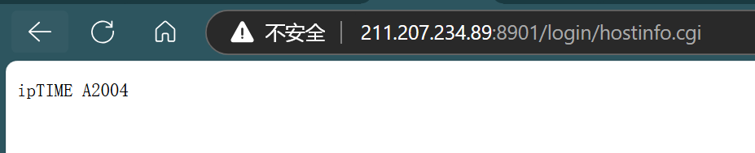

# ipTIME A2004 Unauthorized Access Vulnerability 1

## 0x01 Vulnerability description

A vulnerability is in the '/login/hostinfo.cgi' page of the ipTIME A2004, version is 12.17.0.This flaw allows remote attackers to obtain sensitive information, including version details, without undergoing any authentication process.

```
http://target/login/hostinfo.cgi
```

## 0x02 Affected version

``` 
ipTIME A2004
```

## 0x03 PoC verification

Visiting the corresponding page directly through the browser can reveal the version information about the device, which is included in the Response Headers.



## 0x04 Acknowledgement

Shuanunio

## 0x05 CVE ID

CVE-2024-54763